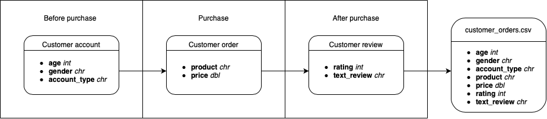

 

If you are completing the PDA, you must follow this template when creating your report. Most sections are designed to cover a specific learning outcome, but the last two sections cover several (the number in parentheses indicates which outcome is covered). 

**If you have any questions about any of the criteria, just let an instructor know.**

# 1. Documentation

#### Domain knowledge (1.1)

Please describe any relevant reading/research you did in the subject and any context necessary for appropriate interpretation of results/visualisations.

For example: *NYC Citi Bikes is a company that...* or *The bike hire industry is...*
  
#### Business requirements (1.2)

Please describe what steps you plan to take to complete this report.

#### Business processes and data flow (1.3)

Create a diagram that shows how the Citi Bike dataset is created (which variables are added when) and demonstrates an understanding of the business process and flow of the data.

For example: 

#### Data visualisation as a tool for decision-making (1.4)

Briefly describe how this report can help NYC Citi Bikes make better data-driven business decisions.

#### Data types (1.5)

List the different types of variables contained in the dataset and explain each of them to a non-technical audience. (e.g. integer, character, datetime)

#### Data quality and data bias (1.6)

Do you have any concerns about bias or quality in the dataset? Why/why not?

# 2. Data cleaning

#### Preparing data for visualisation (1.7)

Please include your cleaning/wrangling steps under this section.

# 3. Data visualisation

#### Process and design (2.1, 2.7, 2.8, 2.9)

Briefly describe your data visualisation process.

For example: *First, I investigated variables of interest with simple single-variable distribution plots. Then I plotted variables of interest to the business against each other to see if any patterns were present in the data. After selecting key visualisations I ensured these were clearly portraying the message I wanted to convey, were aesthetically pleasing, as well as accurate and not misleading. All visualisations were made in RStudio using the `ggplot` package.*

#### Visualisations (2.2, 2.3, 2.4, 2.5, 2.6)

For each plot you include in your report, please:

**Describe the visualisation: what kind of visualisation is it and what information does it contain?**

For example: _This scatter plot shows the relationship between age (years) and spending (GBP), where the red line represents a line of best fit, and the shaded area represents the 95% confidence interval._

**Why is this visualisation important to the business? What does it mean/how can it be used?**

For example: _The highlighted relationship between age and spending can be used by the business to create better targeted advertisements for different age groups as well as make better predictions of customer behaviour._

# PDA Learning Outcomes

## From Communicating with Data (J4Y7 35)

### 1. Prepare data for visualisation

* 1.1. Domain knowledge
* 1.2. Business requirements
* 1.3. Business processes and concept of data flow
* 1.4. Data visualisation as a tool for decision-making
* 1.5. Data types
* 1.6. Data quality and data bias
* 1.7. Preparing data for visualisation

### 2. Create a range of data visualisations to provide business intelligence

* 2.1. Data visualisation workflow
* 2.2. Data visualisation as a tool for decision-making
* 2.3. Types of data visualisation 
* 2.4. Selection of visualisation 
* 2.5. Key elements of a data visualisation 
* 2.6. Key Performance Indicators (KPIs) 
* 2.7. Design of data visualisations
* 2.8. Creating visualisations using software 
* 2.9. Misleading visualisations

## From Working with Data (J4Y6 35)

* 4.6 Time series analysis

