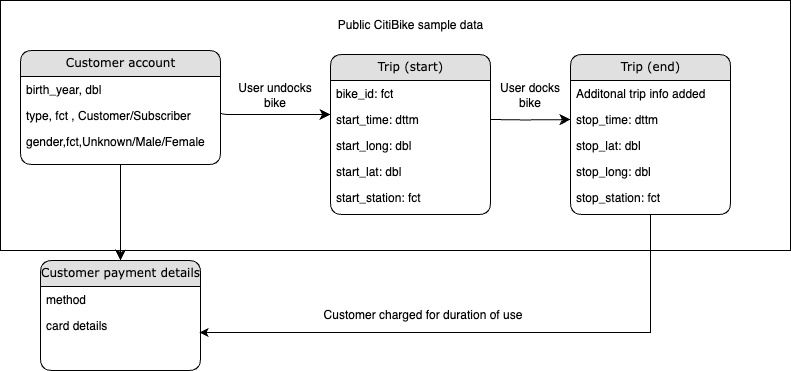

```{r setup, include=FALSE}
knitr::opts_chunk$set(
  message = FALSE, 
  warning = FALSE,
  echo = FALSE
  # eval = FALSE, fig.align = "center",
)
```

```{r}
library(e1071) # tests for skewness
library(ggthemes) # Contains colourblind palette
library(leaflet) # Maps
library(tidyverse)
library(tsibble) # Time-based functions
```


```{r}
# Load clean dataset
# nyc_bikes <- read_csv("clean_data/nyc_bikes.csv",
#  locale = locale(tz = "America/New_York"))

# nyc_bikes <- as_tsibble(nyc_bikes,
#                        index = start_time,
#                        key = "bike_id")
# str(nyc_bikes)
source("data_cleaning_scripts/nyc_citibike.R")
# Not happy with this but simply have too many problems reading
# a tsibble back in again things break right left and centre

citibike_hires <- nyc_bikes_clean
```

# 1. Documentation

## Introduction
<!-- Domain knowledge (1.1) -->

[*Citi Bike*](https://ride.citibikenyc.com/about) is the largest [bike share system](https://en.wikipedia.org/wiki/Bicycle-sharing_system) in the United 
States of America and consists of a fleet of bikes available for hire to users 
at docking stations throughout New York City. Hired bikes can be returned to 
any station. Citi Bike is available for use 24 hours/day, 7 days/week, 
365 days/year.

## Ethics
### Consent

User data obtained by Citi Bike from users creating accounts and accepting terms
and conditions. 
Trip data recorded automatically via electronics on bikes and docking stations. 
Citi Bike has provided a small sample dataset of usage of 10 bikes throughout 
2018.

**Data Source:**

* [NYC Citi Bike trips](https://rdrr.io/github/tidyverts/tsibbledata/man/nyc_bikes.html) dataset from tsibbledata used in this analysis
* [Citi Bike NYC](https://www.citibikenyc.com/system-data) Original Source

### Human Rights: Privacy

Information about people and places but only **anonymised** data stored in 
sample public dataset. Nothing to uniquely identify the demographics or 
behaviour of a particular person.

**User data:** year of birth is stored and not birth date, gender is optional.  
**Location:** latitude and longitude of the start and end of the journey. This 
is the location of the docking bike station only, not the location of a person. 
No live tracking of bikes between start and end stations.

## Business requirements
<!-- (1.2) -->

Citi Bike would like to know more about the following:

* Pattern of bike hires over time
* Do hire patterns differ between bike rider demographics?
* What is the geographical spread of the start points of bike hires?
* Any other insights?

The main Key Performance Indicatior (KPI) that Citi Bike could use to measure 
success is **hires**. A hire is defined as when a bike has been successfully 
undocked at a start station and docked at a destination station. 

We have been given access to a small sample of available data. We will 
initially examine the quality of the data. Visualisations will be created that 
break down hires by different granularity of time periods and then showing 
different demographics and user types. Maps will show the geographical spread by showing the location of stations used for hires. We will also try and visualise 
which stations are in active use at different times of day to identify any 
commuter-related journey directionality. Since payment schemes incentivise short 
journeys we will look at the durations of hires.

## Business processes and data flow
<!-- (1.3) -->



* First time user creates account using website or app. User adds payment 
details and buys a short pass or a long term membership. Customer charged
* User undocks bike by scanning QR code
* User goes on bike trip
* User docks bike
* Citi Bike checks the duration of the hire and charges any payment due in 
excess of user type allowances

## Data visualisation as a tool for decision-making
<!-- (1.4)

Briefly describe how this report can help NYC Citi Bikes make better data-driven business decisions.
-->
By looking at a sample across a full calendar year it may give understanding of 
customer behaviour affecting hires to be aware of and to resource availability 
accordingly. Date and time-related data could be incorporated into the 
scheduling of any promotional campaigns. 

Demographics insights could identify potential groups to 
be targeted by marketing activity or drive further separate research into 
underrepresented sections of the New York City population.

Understanding from maps showing which stations are more or less popular should 
help make sure that enough bikes are provisioned and ready at popular stations 
and that less popular stations could be withdrawn without inconveniencing many 
people.

## Data types
<!-- (1.5) -->
<!-- List the different types of variables contained in the dataset and explain 
each of them to a non-technical audience. (e.g. integer, character, datetime) -->

Inside the original sample dataset we have the following types of data 
available.

`factor` - used to work with categorical data, data that has a fixed and known 
set of possible values. These are both numbers and text.

`double` -  for numerical data, any decimal number. In our data location is continuous numeric and things like year of birth are discrete.

`POSIXct` - represent dates and times (ct = calendar time).

Here is further information about the data provided which uses these data types 
in the sample.

### Factor

* `bike_id`: Which particular bike is used during the hire.  

* `start_station`,`end_station`: Which particular starting station
the bike began it's trip and which destination station it ended up at the end 
of the journey.

* `type`: User type.  
**'Customer'** purchased a short-term 24-hour or 3-day pass  
**'Subscriber'** is a long-term Annual Member

### Date and time (S3: POSIXct)
`start_time`,`stop_time`: What date and time the bike trip started/ended a trip 
as part of a hire.

### Location (double)
We have the latitude and longitude as numbers telling us the exactly where the 
bike stations used during a hire are located.

* `start_lat`,`end_lat`: Latitude of starting/ending station. 
* `start_long`,`end_long`: Longitude of starting/ending station.

### User-supplied information
* `birth_year`: (double) The bike rider’s year of birth.  
* `gender`: (factor) User can optionally declare their gender 
(Male/Female/Unknown).


## Data quality and data bias
<!-- (1.6) 
Do you have any concerns about bias or quality in the dataset? Why/why not?
-->

### Quality
The data supplied as part of the sample appears to be of high quality, no 
missing records were detected. Some parts are directly supplied by the user such
as Gender/Year of birth. Others appear to be generated automatically 
electronically via e.g. users using an app for unlocking bikes. The preliminary analysis revealed over that for over 6% of trips the gender of the user was 
unknown. A couple of entries gave year of birth of the person hiring the bike 
as being in the 1880s.

### Bias
The dataset has been provided by the Citi Bike company obtained from 
their systems. The data we have is a sample of a larger dataset. We have no way 
of independently verifying whether the technical information gathered by 
Citi Bike about hires is accurate e.g. are the date/time stamps correct?

The Citi Bike hire process involves users using their mobile phones to 'unlock'
bikes. We will be unable to determine from this dataset whether there are 
people who would like to use the bikes but do not have a mobile phone or can't
use the apps involved. There is no information on failed attempts e.g. technical
faults or not enough bikes available for users wishing to travel. We do not have 
a full list of available stations so are unable to gauge how our sample aligns 
with all stations or whether some are not being used at all.

We have been provided with no initial information about about how this smaller 
sample was generated e.g. whether truly random over the full data or whether the
sample is from a specific subcategory of e.g. stations/bikes/users/location or 
other data Citi Bike holds but not made public. We are unable to claim how well 
this sample represents the full dataset to which we do not have access. Later 
after showing some visualisations we will suggest some of the kinds of data that
might have been specifically excluded to create our sample.

Riding a bike usually involves people learning to balance themselves on two 
wheels. If someone has never learned to ride a bike they will initially be 
unable to use these services. There is no indication of people who may wish to 
do so but are physically unable. People with motor disabilities or sensory ones 
relating to motion, cognitive regarding using apps etc. will be 
under-represented as potential users.

Possible undercoverage? We are in a population-dense urban environment. The 
sample is only for over 4,000 trips over the course of 2018 for just 10 
different bikes and just over 50 stations. We can only examine that particular 
year in isolation without testing whether there are year-to-year trends such 
seasonal variations.

Response: there are some questionable entries in birth year information 
provided by the user so might have been a bug or design issue in app or users 
deliberately choosing the wrong year.

# 2. Data cleaning

## Preparing data for visualisation
<!-- (1.7)

Please include your cleaning/wrangling steps under this section. -->
A separate preliminary analysis was used for examining the initial quality of 
the data. As a result a separate cleaning script inside data_cleaning_scripts 
was created to do a small amount of cleaning/wrangling was done to add extra date/time-related columns to thedata for convenience when visualising the 
dataset as plots.

The customer explicitly wanted age to be analysed so we calculated the age of 
the rider at the time of the hire in 2018.

# 3. Data visualisation

## Process and design
<!-- (2.1, 2.7, 2.8, 2.9)

Briefly describe your data visualisation process. 

For example: *First, I investigated variables of interest with simple single-variable distribution plots. Then I plotted variables of interest to the business against each other to see if any patterns were present in the data. After selecting key visualisations I ensured these were clearly portraying the message I wanted to convey, were aesthetically pleasing, as well as accurate and not misleading. All visualisations were made in RStudio using the `ggplot` package.*
-->
In the preliminary analysis I made rough plots/tables to examine the range and
distribution of available data. From there I chose which time-based information 
seemed most valuable for business decision making. 

For demographics it seemed helpful to combine both age and gender on the same 
diagram. This uncovered a possible issue with data quality regarding age for 
Citi Bike to examine later.

I tried to make sure the plots were as aesthetically pleasing as possible, 
correctly labelled and used colour schemes to assist those with 
colour-blindness.

For some visualisations the plots raised further questions regarding particular 
points of interest. For these items I supplemented plots with some tabular 
information for more detailed information.

Most visualisations were made in RStudio using the `ggplot` package.
Maps used the `leaflet` package.

## Visualisations
<!-- (2.2, 2.3, 2.4, 2.5, 2.6) 
For each plot you include in your report, please:

**Describe the visualisation: what kind of visualisation is it and what information does it contain?**

For example: _This scatter plot shows the relationship between age (years) and spending (GBP), where the red line represents a line of best fit, and the shaded area represents the 95% confidence interval._

**Why is this visualisation important to the business? What does it mean/how can it be used?**

For example: _The highlighted relationship between age and spending can be used by the business to create better targeted advertisements for different age groups as well as make better predictions of customer behaviour._
-->

```{r}
# Visualisation variables for consistent plots
plot_bar_colour <- "white"
plot_theme <- theme_minimal(base_size = 12)
```

### Hires over time

#### Hires by Day of Year
```{r}
# Aggregate by date
citibike_hires_by_date <- citibike_hires %>%
  index_by(start_date) %>%
  summarise(hires = n())

citibike_hires_by_day_of_year <- citibike_hires_by_date %>%
  ggplot(aes(x = start_date, y = hires)) +
  geom_line() +
  plot_theme +
  labs(
    title = "Hires by Day of Year",
    subtitle = "Sample data from 2018",
    x = "\nDate",
    y = "Number of Hires\n"
  )
citibike_hires_by_day_of_year
ggsave("analysis_and_documentation/images/plot_01_citibike_hires_by_day_of_year.png")
```
This line plot shows the pattern of hires per day of 2018.
Hires are lower in winter months, higher in summer. 

Citi Bike could do promotions at quieter times of year to try and encourage more usage. They could further examine the top days and was there anything they did 
to boost hires in the past and to repeat anything similar in future. On 21 days 
hires were barely measurable with only a single hire. Check for reasons why this
may be e.g. was the weather particularly severe, were there road problems, was 
something affecting accurate usage recording like mobile phone network problems,
were Citi Bike having other technical issues etc.

See appendix for tables of [dates of highest and lowest hires](#tables-of-dates-of-highest-and-lowest-hires).

#### Hires by Month
```{r}
# Aggregate by month of year
citibike_hires_by_month <- citibike_hires %>%
  index_by(start_month_name) %>%
  summarise(hires = n()) %>%
  ggplot(aes(x = start_month_name, y = hires)) +
  geom_point() +
  geom_line(group = 1) +
  plot_theme +
  labs(
    title = "Hires by Month",
    subtitle = "Sample data from 2018",
    x = "\nMonth",
    y = "Number of Hires\n"
  )
citibike_hires_by_month
ggsave("analysis_and_documentation/images/plot_02_citibike_hires_by_month.png")
```

This line plot shows the pattern of hires each month of 2018.

This confirms a steadily rising number of hires per month between February and 
peaking in August. Usage then drops very sharply in September and carries on 
dropping til the end of the year.

Interestingly the drop is not as steep from September to October. If data from 
later years is available they should check whether there's a similar effect. 
Is there a new source of customers specifically in October perhaps related to 
marketing activity or an influx shortly after start of academic term for 
students in New York?

#### Hires by Day of the Week
```{r}
# Aggregate by day of week
weekend_days <- c("Sun", "Sat")
day_type_labels <- c("Weekday", "Weekend")
citibike_hires_by_day_of_week <- citibike_hires %>%
  index_by(start_day_of_week) %>%
  summarise(hires = n())

citibike_hires_by_day_of_week %>%
  ggplot(aes(x = start_day_of_week, y = hires, fill = start_day_of_week %in% weekend_days)) +
  geom_col() +
  geom_text(aes(label = hires), vjust = 1.5, colour = "white") +
  scale_fill_colorblind("Type of Day",
    labels = day_type_labels
  ) +
  plot_theme +
  labs(
    title = "Hires by Day of the Week",
    subtitle = "Sample data from 2018",
    x = "\nDay of Week",
    y = "Number of Hires\n",
    fill = "Weekend"
  )
ggsave("analysis_and_documentation/images/plot_03_citibike_hires_by_day_of_week.png")
```

This bar plot shows the pattern of hires for each day of the week totalled 
across the whole of 2018 and highlighting which days are weekday/weekend usage. 
The taller the bars the more successful hires there were.

This should give an initial broad indication of the differences in usage between
traditional work weekdays for office workers and leisure at weekends. Hires are 
lower at weekends than weekdays. There should be scope for encouraging more 
leisure trips within the current service capacity. Could leisure promotions
for weekends help compensate for loss of local weekday commuters? There is no 
immediately obvious reason from this dataset why Tuesday should be higher than 
the others.

#### Hires by Hour of Day
```{r}
# Aggregate by hour of day
office_hours <- c(8:18) # 9-5 and 1 hr commute

citibike_hires_by_hour_of_day <- citibike_hires %>%
  index_by(start_hour_of_day) %>%
  summarise(hires = n())

citibike_hires_by_hour_of_day %>%
  mutate(is_office_hours = if_else(start_hour_of_day %in% office_hours,
    "Yes", "No"
  )) %>%
  ggplot(aes(x = start_hour_of_day, y = hires, fill = is_office_hours)) +
  geom_col() +
  scale_fill_colorblind("Office Hours") +
  plot_theme +
  scale_x_continuous(breaks = 0:23) +
  labs(
    title = "Hires by Hour of Day",
    subtitle = "Sample data from 2018",
    x = "\nHour of Day",
    y = "Number of Hires\n",
    fill = "Office Hours"
  )
ggsave("analysis_and_documentation/images/plot_04_citibike_hires_by_hour_of_day.png")
```
This bar plot shows hires for all 24 hours of the day across the whole of 2018.
The taller the bars the more successful hires there were.

As might be expected, this shows peak movement before and after "office hours" 
(traditionally 9am-5pm with an hour commuting either side, this is marked by 
yellow bars). Remember this was before COVID-19 when many more people commuted 
into city centre offices for work. 

Could Citi Bike do deals with larger workplaces to help workers be more 
physically active to improve wellbeing and reduce business expenses? Hires are remarkably consistent from 11am to 3pm as seen by the dip in the middle of the 
day. Incentivise tourists or retired people to encourage more use during these 
hours. No real sign of workers going on bike trips during lunch (12-2pm). Exceptionally light usage from 1-4am, target late shift workers in e.g. 
health/emergency or leisure sectors such as the nearby casinos along the 
waterfront.

### Demographics: Hires by Month and User Type 

**Subscriber vs Customer**

```{r}
citibike_hires_user_type <- tibble(citibike_hires) %>%
  select(type, start_month_name) %>%
  group_by(type, month = start_month_name) %>%
  summarise(hires = n())

citibike_hires_user_type %>%
  ggplot(aes(x = month, y = hires, fill = type)) +
  geom_col() +
  plot_theme +
  scale_fill_colorblind() +
  labs(
    title = "Hires by Month and User Type",
    subtitle = "Sample data from 2018",
    x = "\nMonth",
    y = "Number of Hires\n",
    fill = "User Type"
  )
ggsave("analysis_and_documentation/images/plot_05_citibike_hires_user_type.png")
```

This bar plot shows hires by users who are customers vs. subscribers each month
of 2018. The taller the bars the more successful hires there were.

Overwhelming majority of users are subscribers with yearly membership. Suggests 
a general high-degree of satisfaction with the service Citi Bike offers. Use 
this vote of confidence in promotions to tempt potential new users using 
incentives to try a short pass first - discounts to "upgrade" to full membership
for new customers. Proportion of customers seems highest in the summer months. 
Are people more likely to experiment with short passes for the Citi Bike service
in good weather? Are tourists accounting for higher summer customers?  

Subscribers drop greatly from August to September and again from October to 
November. Subscribers are those who paid for a full year of use. This suggests 
that a significant group of those who took out subscriptions in August or 
October previously in 2017 did not choose to renew at that time. Were there any 
special promotions those months in the previous year? Do people move house or 
change jobs frequently in this area?

Using account contact details Citi Bike could periodically survey users for 
optional data around intended use for greater insights or revealing unmet needs.
Reward loyal customers to improve retention, recommend to friends to get 
discounts off next year of subscription etc.

### Demographics: Hires by Age and Gender

```{r}
citibike_hires_user_age <- tibble(citibike_hires) %>%
  select(rider_age, birth_year, gender)

citibike_hires_user_age %>%
  ggplot(aes(x = rider_age, fill = gender)) +
  geom_histogram(
    colour = plot_bar_colour,
    binwidth = 1
  ) +
  plot_theme +
  scale_fill_colorblind() +
  labs(
    title = "Hires by Age and Gender",
    subtitle = "Sample data from 2018",
    x = "\nAge of Rider",
    y = "Number of Hires\n",
    fill = "Gender"
  )
ggsave("analysis_and_documentation/images/plot_06_citibike_hires_user_age_gender.png")
```
This bar plot shows the numbers of users broken down by the age of the person 
making the hire and their gender during 2018. The taller the bars the more 
successful hires there were.

What immediately leaps out is the curious very high number of hires recorded as 
'Unknown' but only in one particular age. We will examine this later.

We can see that males make a far higher proportion of users than females.
According to [US Censux New York City](https://data.census.gov/table?q=population+by+sex+&t=Age+and+Sex&g=160XX00US3651000&tid=ACSSE2021.K200101) females currently outnumber males.

There's very low usage for late teenage years and early twenties for all genders.
But other than that, more broadly there does seem to be a positive skew towards 
younger riders under 40 using the service more than older age groups, with peaks
for users in their 30s. We will now test this.

#### Testing skew by age
```{r}
citibike_hires_user_age_skewed <- citibike_hires_user_age %>%
  select(rider_age) %>%
  summarise(skewness = skewness(rider_age, type = 1))

citibike_hires_user_age_skewed
```

The age distribution is confirmed as being moderately right-skewed with greater 
hires by younger people than older.

#### Examining hires by gender

```{r}
citibike_hires_gender <- citibike_hires_user_age %>%
  select(gender) %>%
  group_by(gender) %>%
  summarise(hires = n()) %>%
  ungroup() %>%
  arrange(desc(hires))
citibike_hires_gender
```

Percentage of those providing a gender as 'Female' vs 'Male' 
= 930/3069 * 100 = 30.3%. This suggests there could be well over 2,000 available females in this sample not using the service compared to males.

More research should be done into why females are less likely to use the
Citi Bike service. Do we know whether females are *deliberately* choosing not to 
use the services or are there factors like whether they've learned to ride a 
bike when younger? Are there concerns about personal safety travelling alone, on
roads or at night and in the dark?

Citi Bike should consider demographically targeted marketing campaigns to 
women e.g. online adverts. 

Are there cycling groups who could encourage new members to join them to learn 
how to ride and make cycling 'buddies'.

#### Checking the high number of Unknown gender on only one age group

We will try to investigate why there is such a high proportion of unknown gender 
for just one particular age.

```{r}
citibike_hires_user_age_unknown <- citibike_hires_user_age %>%
  filter(gender == "Unknown") %>%
  group_by(rider_age, birth_year, gender) %>%
  summarise(hires = n()) %>%
  ungroup() %>%
  arrange(desc(hires)) %>%
  top_n(3)

citibike_hires_user_age_unknown
```
We see that those who claimed to be 49 (born in 1969) account for an 
extraordinarily high proportion of people not supplying a gender.
This maybe suggests these particular users do not want to give accurate 
information about themselves and seem to be selecting a dummy value for year of 
birth. Another potential cause - it may be worth doing some technical checks 
with web/app staff - was there something in the user interface that was 
defaulting to a birth year of 1969 that people maybe simply didn't bother 
changing?

Developers could test if they also offered to make providing a year of birth 
optional the same way as gender whether the number claiming a birth year of 
1969 would drop and improve the overall accuracy of the age data.

### Hires by geographical spread

#### Start station

```{r}
# A hire needs at least a start_station
citibike_hires_station_start_locations <- tibble(citibike_hires) %>%
  select(start_station, start_lat, start_long) %>%
  group_by(start_station, start_lat, start_long) %>%
  summarise(number_of_hires = n()) %>%
  ungroup()
```

```{r}
citibike_hires_station_start_map <- leaflet(citibike_hires_station_start_locations) %>%
  addTiles() %>% # use the default base map which is OpenStreetMap tiles
  # ?addMarkers

  addCircleMarkers(
    lng = ~start_long,
    lat = ~start_lat,
    radius = ~ number_of_hires / 50,
    # popup = ~paste("<strong>Number of Hires:</strong>", number_of_hires),
    popup = ~ paste(
      "<strong>Number of Hires:</strong>", number_of_hires,
      "<br /><strong>Station Number:</strong>",
      start_station
    ),
    label = ~ paste("Number of Hires:", number_of_hires)
  ) 

citibike_hires_station_start_map
```
This map shows the locations where hires started, the larger the red circle 
the more journeys started there. The customer only requested start stations but it is not much more work to also consider end stations too.

#### End station
```{r}
citibike_hires_station_end_locations <- tibble(citibike_hires) %>%
  select(end_station, end_lat, end_long) %>%
  group_by(end_station, end_lat, end_long) %>%
  summarise(number_of_hires = n()) %>%
  ungroup()
```

```{r}
citibike_hires_station_end_map <- leaflet(citibike_hires_station_end_locations) %>%
  addTiles() %>% # use the default base map which is OpenStreetMap tiles
  # ?addMarkers

  addCircleMarkers(
    lng = ~end_long,
    lat = ~end_lat,
    radius = ~ number_of_hires / 50,
    # popup = ~paste("<strong>Number of Hires:</strong>", number_of_hires),
    popup = ~ paste(
      "<strong>Number of Hires:</strong>", number_of_hires,
      "<br /><strong>Station Number:</strong>",
      end_station
    ),
    label = ~ paste("Number of Hires:", number_of_hires),
    color = "red"
  ) 

citibike_hires_station_end_map
```

This map shows the locations of stations where user ended their journey and 
docked their bike. The larger the red circle the more times this station was 
at the end of a user journey.

**Comments re geographical locations**

Since we know that Citi Bike operates throughout New York City, after plotting 
locations of hires it makes us assume that the sample data we have been provided 
with is itself filtered to restrict it to a smaller geographical area of study. 
This now frames our dataset as being much more relevant to short, local journeys
close to Jersey City than those going long distances elsewhere. This is a little 
confusing as technically Jersey City is part of New Jersey state not New York 
state so the areas covered by NYC Citi Bike are wider than their literal 'NYC' 
name would suggest. But this does make sense as Jersey City is very close, only separated from New York City by the river Hudson. Slightly to the South are the 
world famous tourist destinations of the Statue of Liberty and Ellis Island.

What is striking comparing the start station and end station maps is how similar 
the patterns are, especially when looking at the larger circles with more hires. 
As they are so similar this suggests a high proportion of 'return' journeys 
where the user goes between two stops initially then later completes the same 
journey *in reverse*, making the number of hires more balanced. As there is no 
tracking of individuals and a user returning later in the day may choose a 
different bike (by `bike_id`) in this dataset it is not possible to verify 
return journeys. But as the peaks shown in the previous chart of hires by hours 
of day are around traditional work commuting times this may support the idea 
that some of the peak usage of bikes during the day is for commuting between 
work and home. We'll look at this again in the the "Station usage" section.

Station number 3186 near the junctions of Christopher Columbus Drive and Grove 
Street is by far the most popular individual station used 433 times as start 
station and 577 as end station. This particular station is positioned between 
the 'old' downtown area and the newer multi-storey residential apartments and business blocks mostly financial companies further east. Such locations may make
for a higher density of wealthy potential users so it might be worth positioning stations close to taller buildings. Is is also very close to [Grove Street station (PATH)](https://en.wikipedia.org/wiki/Grove_Street_station_(PATH)) underground 
train station which may suggest people are using the bikes for a leg of a longer journey via public transport.

In general the other more popular stations are closer to the heart of Jersey 
City in high rise accommodation many towards the newer waterfront areas where 
many businesses are located and entertainment such as casinos. These hires could 
possibly also be people connecting with ferries if they are travelling to/from 
further away. Others are nearby stops on the light railway system. There may be 
scope for experimenting with "park and ride" schemes to link up with other 
public transport systems.

## Other insights
### Station usage

We'll now take a closer look at patterns of **from** and **to** journeys to see 
hich routes are more popular.

The following charts show all the recorded start and end stations by unique 
station number with the number of hires for each over the entire year. The 
darker the blue square, the more hires. There are two grids showing patterns at 
different times of day, one for AM and another for PM. 

```{r}
# Journey between start station and end station
citibike_journeys <- tibble(citibike_hires) %>% 
  select(start_station, end_station,
          start_lat, start_long,
          end_lat, end_long, start_hour_of_day) %>% 
  mutate(is_am = if_else(start_hour_of_day < 12, TRUE, FALSE) ) %>% 
  group_by(start_station, start_lat, start_long,
           end_station, end_lat, end_long, is_am) %>% 
  summarise(number_of_journeys = n()) %>%
  ungroup()
```

```{r}
# Show a grid of hires between a start and end station
plot_bike_journeys <- function(df) {
  plot <- df %>%
    ggplot(aes(x = end_station, y = start_station, fill = number_of_journeys)) +
    # ?geom_tile
    geom_tile(color = "white") +
    coord_fixed() + # make boxes square
    guides(fill = guide_colourbar( # barwidth = 20,
      # barheight = 10,
      title = "Hires"
    )) +
    plot_theme +
    scale_fill_gradient(low = "lightblue", high = "darkblue") +
    theme(
      legend.position = "bottom",
      axis.text.x = element_text(angle = 90),
      axis.text.y = element_text(angle = 0)
    ) +
    labs(
      title = "Station activity by number of hires",
      subtitle = "Hires for each unique start and end station combination",
      x = "End station",
      y = "Start station",
    )
  return(plot)
}
```
```{r fig.height = 8, fig.width = 8}
# Night and orning Journeys made from 0-11 (am)
citibike_journeys_am <- citibike_journeys %>%
  filter(is_am == TRUE)

plot_bike_journeys(citibike_journeys_am) + 
  labs(title = "Station Activity by Hires, AM (0-11hrs)")
ggsave("analysis_and_documentation/images/plot_07_station_usage_am.png")
```

```{r fig.height = 8, fig.width = 8}
# afternoon, evening and night Journeys made from 12-23 (pm)
citibike_journeys_pm <- citibike_journeys %>%
  filter(is_am == FALSE)

plot_bike_journeys(citibike_journeys_pm) + 
  labs(title = "Station activity by Hires, PM (12-23 hrs)")
ggsave("analysis_and_documentation/images/plot_08_station_usage_pm.png")
```

Both charts show the majority of start stations being used to go to **multiple** 
different end stations.

```{r}
citibike_journeys_least_used_start_station <-  citibike_journeys %>% 
  count(start_station) %>% 
  slice_min(n) %>% 
  mutate(n = NULL)

citibike_journeys_least_used_end_station <-  citibike_journeys %>% 
  count(end_station) %>% 
  slice_min(n)%>% 
  mutate(n = NULL)

distinct_start_stations <- citibike_journeys %>% 
  distinct(start_station)

number_distinct_start_stations <- pull(count(distinct_start_stations))

distinct_end_stations <- citibike_journeys %>% 
  distinct(end_station)
number_distinct_end_stations <- pull(count(distinct_end_stations))

number_of_journeys <- pull(count(citibike_journeys))

# Calculate how many return to the same station they started
citibike_journeys_return_to_start <- citibike_journeys %>% 
  filter(as.numeric(start_station) == as.numeric(end_station))

number_of_journeys_return_to_start <- pull(count(citibike_journeys_return_to_start))
percent_of_journeys_return_to_start <- round( number_of_journeys_return_to_start/number_of_journeys * 100, digits = 1)
```
`r number_distinct_start_stations` different start stations were used.

`r number_distinct_end_stations` different end stations were used.

There are `r number_of_journeys` unique combinations of start and end station 
used for journeys. Only `r percent_of_journeys_return_to_start`% journey routes 
end with the same bike being returned to the station the user started from. So 
it's rare for someone to take the same bike out e.g. going shopping nearby then 
returning without docking at another station first. This is good as it keeps bikes 
available for other users and users are avoiding paying financial penalties for 
long durations.

The variety of stations used for journeys suggests users utilise the wide range 
of choice of different available places from the distributed network of stations.
This is a current strength of Citi Bike but could this make it expensive to 
expand in future to maintain user expectation of choice available?

##### Commuting revisited

To check again about commuting using the most popular station as an 
example. In AM the most popular journey in the mornings is from 
3203 to 3186. In PM it's from 3186 to 3203. 3186 is [Citi Bike: Grove St PATH](https://maps.app.goo.gl/t95TnV2cwXLwTKZz9), 
Station 3203 is to the north is [Citi Bike: Hamilton Park](https://maps.app.goo.gl/GcytqV34AL794rJEA). Although not far away 
physically, the Hamilton Park stop is in a much more residential area compared 
to the more 'business' like Grove Street, which might show people returning home 
from work. 3203 is also near to a huge mall complex so other possibilities are 
people going shopping/eating etc. after work.

#### Least used stations

```{r}
#citibike_journeys_least_used_start_station
# Contains:  3188

#citibike_journeys_least_used_end_station
# Contains: 514, 3188, 3216

# 3188 appears in both so we could just use the end stations
citibike_journeys_least_used_stations <- citibike_journeys_least_used_end_station 

citibike_hires_least_used_station_locations <- citibike_hires_station_end_locations %>% 
  filter(end_station %in% citibike_journeys_least_used_stations$end_station)

citibike_hires_least_used_station_map <- leaflet(citibike_hires_least_used_station_locations) %>%
  addTiles() %>% # use the default base map which is OpenStreetMap tiles
  
  addMarkers(
    lng = ~end_long,
    lat = ~end_lat,
    label = ~ paste("Number of Hires:", number_of_hires),
  ) 

citibike_hires_least_used_station_map
```

N.B. We have not been given a full list of available bike stations so we cannot 
tell from the sample data we've been provided with whether there are any bike 
stations completely unused. However, on this map we show the **least used** 
stations where they have only been recorded as having been used **once** for a 
hire start or end station for the whole year. Geographically these are more 
remote from the centre of Jersey City. 

### Duration
```{r}
# View(nyc_bikes)
citibike_hires_duration_duration <- citibike_hires %>%
  select(hire_duration, type, gender, rider_age) %>%
  mutate(
    hire_duration_minutes =
      round(as.numeric(hire_duration, "minutes")),
    duration_category =
      case_when(
        hire_duration_minutes < 10 ~ "< 10 minutes",
        between(hire_duration_minutes, 10, 19) ~ "10 -19 minutes",
        between(hire_duration_minutes, 20, 29) ~ "20 -29 minutes",
        # between(hire_duration_minutes, 30, 3600)  ~ "30 minutes - 6 hours",
        hire_duration_minutes >= 30 ~ "> 30 minutes",
        # hire_duration_minutes >= 10 <= 5 ~ "Medium 10 -19 minutes",
        TRUE ~ "Unknown"
      ),
    .after = hire_duration
  )

citibike_hires_duration_duration %>%
  ggplot(aes(x = fct_infreq(duration_category), fill = type)) +
  geom_histogram(stat = "count") +
  plot_theme +
  scale_fill_colorblind() +
  scale_y_continuous(labels = scales::comma) +
  labs(
    title = "Hires by Duration Category and User Type",
    subtitle = "Sample data from 2018",
    x = "\nDuration Category",
    y = "Number of Hires\n",
    fill = "User Type"
  )
ggsave("analysis_and_documentation/images/plot_09_citibike_hires_duration.png")
```

This plot shows number of hires broken down by the amount of time the journey 
took i.e. the duration and user type. Duration is technically the time taken 
between a bike being undocked at a 'start' station and docked at a destination
'end' station. The taller the bars the more successful hires there were.

[Citi Bike pricing](https://citibikenyc.com/pricing) already offers financial 
incentives to keep trips < 30 minutes by charging extra per 15 mins over. 
Majority of trips are well within this with the highest usage being very short 
trips lasting less than 10 minutes. Users find Citi Bike worthwhile even for 
relatively short journeys outweighing any inconvenience of time spent walking 
to find a bike.

Subscribers with yearly membership massively favour journeys under 10 minutes 
reinforcing that those who use the service regularly are often making very short 
trips. Whereas for customers, their most popular duration was greater than 30 
minutes closely followed by 10-19 minutes This may be down to people trying 
out the service before committing to a subscription or greater use by 
occasional users possibly including tourists for longer sight-seeing trips. 
As mentioned previously there are relatively few customer users but they may be 
generating proportionally more income per hire by going 'over' the 30 minute 
boundary for extra payments charged.

```{r}
citibike_hires_duration_totals = as_tibble(citibike_hires_duration_duration) %>% 
  select(duration_category, type) %>% 
  group_by(duration_category, type) %>% 
    summarise(count = n()) %>% 
  arrange(desc(count))
citibike_hires_duration_totals
```

### Sample data excluded?
We saw from the maps that the geographical area covered is a subset of the 
larger Citi Bike network so is restricted in physical coverage. Looking at the 
high degree of symmetry from the maps and the station usage visualisations it 
feels like the type of trip that is under-represented is a 
**one-way journey from point A to B**.

Looking again at the [documentation for the dataset](https://rdrr.io/github/tidyverts/tsibbledata/man/nyc_bikes.html)

>  "Type:	The type of trip. A "Customer" has purchased either a 24-hour or 3-day 
pass, and a "Subscriber" has purchased an annual subscription."

The Citi Bike website publishes [monthly operating reports](https://citibikenyc.com/system-data/operating-reports) based on data 
from their service.
For e.g. [July 2018 (PDF)](https://d21xlh2maitm24.cloudfront.net/nyc/July-2019-Citi-Bike-Monthly-Report.pdf?mtime=20190913182531). In the section marked "Membership"

> Citi Bike members purchased or renewed 22,429 annual passes, 
184,887 single-trip passes, 59,353 single-day passes, and 4,715 three-day passes
in July. 

This will be for the entire Citi Bike network that month, not just the 
geographical area in our sample. So our sample dataset appears to not include 
data for the **single-trip** passes mentioned. So any interpretation of results 
here will not reflect a large portion of such journeys actually made in practice.
Single-trip passes are the cheapest option for users and are the most popular 
option, high in number but bring in less revenue than annual or single-day 
passes e.g. for [Citi Bike prices in 2018](https://web.archive.org/web/20190302090833/https://www.citibikenyc.com/pricing/single-ride) applied to the July 2018 report.

| Pass | Purchased | Price(\$) | Revenue(\$) |
| ---- | -----:| --------:| -------:| 
| annual | 22,429 | 169 | `r format(22429*169,nsmall=0,big.mark = ",")` |
| single-day | 59,353 | 12 | `r format(59353*12,nsmall=0,big.mark = ",")` |
| single-trip | 184,887 | 3 | `r format(184887*3,nsmall=0,big.mark = ",")` |
| three-day | 4,715 | 24 | `r format(4715*24,nsmall=0,big.mark = ",")` |

## Recommendations

* Different patterns of usage across a calendar year. Much less usage 
in winter. Suggest further research to see if people feel too unsafe to use 
the service in poor weather. 
* Promote better short passes deals for fair weather "day trip" users, these are 
potential new subscribers who might wish to experiment with the service before 
commiting to a full year.
* Heaviest usage during weekday work commute times. Work with employers for 
Citi Bike to be part of employee benefit schemes.
* Older people could be targeted using more traditional forms of advertising 
like through newspapers/radio/TV. Retired people could be offered discounts to 
possibly help take up the spare capacity available in the middle of the day. 
* Considerably more Males use the service than females. Quick win could be to 
attempt to grow female usage through targeted marketing campaigns and working 
with female-oriented groups in the area.
* Developers/designers should check whether the user information interface 
provided could be adjusted to make birth_year optional to improve quality of 
age data reducing those deliberately choosing to enter a false year.
* 3 stations have only been used *once* in a year, these could be good candidates 
for removal from service without greatly disrupting existing users. If the 
company wishes to economise they could consider whether these stations are 
worth retaining, would the resources be better redeployed to other locations?

## Appendix

### Tables of dates of highest and lowest hires

#### Top 10 highest hires dates
```{r}
top_10_hire_dates <- citibike_hires_by_date %>%
  arrange(desc(hires)) %>%
  head(10)

top_10_hire_dates
```

#### Lowest (single) hire dates

```{r}
lowest_hire_dates <- citibike_hires_by_date %>%
  filter(hires == 1) %>%
  arrange(hires)

#print(lowest_hire_dates, n = Inf)
lowest_hire_dates
```

