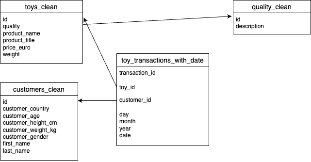

# Data Transformation Task
```{r}
library(tidyverse)
```

## 1
Load in the transaction data and create a column date from the day, month and year columns.
```{r}
toy_transactions <- read_csv("raw_data/toy_transactions.csv")

toy_transactions_with_date <- toy_transactions %>%
  mutate(date = as.Date(make_datetime(year, month, day)))

# N.B. This could also be done in base R as below but this would involve
# processing a string which I think would be less efficient for things
# already numbers
# mutate(date = as.Date(paste(year, month, day, sep = "-")))

toy_transactions_with_date
```
## 2
Load in the toys data and:

1. Convert the weight column to numeric.
2. Split the extra information from the product into a new column, so you have two columns: product_name and product_title. Make sure you don’t have any extra whitespace in either column.

```{r}
toys <- read_csv("raw_data/toys.csv")
toys_clean <- toys %>%
  # Extract weight as a number
  mutate(weight = parse_number(weight)) %>%
  # Split into new column
  separate(product, c("product_name", "product_title"), " - ") %>%
  # remove any leading/trailing space
  mutate(
    product_name = str_trim(product_name),
    product_title = str_trim(product_title)
  )

toys_clean
```

## 3
Load in the dataset on quality labels and:

1. Remove the unnecessary information for each descriptor
2. Replace the categories so ‘Awesome’ and ‘Very Awesome’ become ‘Good’ and 
‘Very Good’. Do the same thing for ‘Awful’ replacing it with ‘Bad’.
```{r}
quality <- read_csv("raw_data/quality.csv")
# View(quality)

quality_clean <- quality %>%
  # Remove the unnecessary information for each descriptor
  mutate(description = str_replace_all(description, "Quality: ", "")) %>%
  # Replace the categories so ‘Awesome’ and ‘Very Awesome’ become ‘Good’
  # and ‘Very Good’. Do the same thing for ‘Awful’ replacing it with ‘Bad
  mutate(
    description = case_when(
      description == "Awesome" ~ "Good",
      description == "Very Awesome" ~ "Very Good",
      description == "Awful" ~ "Bad",

      # I'm assuming 'Very Awful' has to be treated like 'Very Awesome' but if
      # meant literally *only* 'Awful' I would comment the following line out
      description == "Very Awful" ~ "Very Bad",
      TRUE ~ description
    )
  )

quality_clean
```

## 4
With fs::dir_ls() you can first list all files which meet a certain regex pattern (regexp argument). So for example, any files that have a .csv extension. You can then pipe those file path names into purrr::map_dfr() to apply read_csv() to all of them and bind them all into one dataframe.

[Here is a tutorial on how to do it](https://www.gerkelab.com/blog/2018/09/import-directory-csv-purrr-readr)

Using the steps above, create a dataframe called customers which contains data on customers from all countries by reading in and binding all customer datasets in one pipeline.

```{r}
customers <- fs::dir_ls("raw_data",
  regexp = "_customers\\.csv$"
) %>%
  map_dfr(read_csv)

customers
```

## 5
Impute missing values in numeric columns with the median value of customers with the same gender and country. For example, a customer whose gender is female and whose country is Australia with a missing age should get the median age of all Australian females in the dataset.

Hint: You can combine a group by() with mutate(across()) to apply coalesce across columns which meet a logical criteria specified with where(). Also remember, in across() we can define our own anonymous function like so ~ mean(.x, na.rm = TRUE) where the .x represents what is being iterated on (when using across, this is the columns).

```{r}
customers_clean <- customers %>%
  group_by(customer_gender, customer_country) %>%
  mutate(across(
    where(is.numeric),
    ~ coalesce(., median(.x, na.rm = TRUE))
  ))

customers_clean
```

## 6
```{r}
# transactions = toy_transactions_with_date
# toy details = toys_clean
# customers = customers_clean
# quality = quality_clean
```
 

## 7
Join your four cleaned datasets together and call the joined dataset toys_joined. This join should keep all observations from all tables.

```{r}
toys_joined <- toy_transactions_with_date %>%
  full_join(toys_clean, by = join_by("toy_id" == "id")) %>%
  full_join(customers_clean, by = join_by("customer_id" == "id")) %>%
  full_join(quality_clean, by = join_by("quality" == "id"))

toys_joined
```

## 8
Are there any ethical and legal considerations with storing this data in its current state?

Write a short answer

Data contains European customers so will be affected by GDPR legislation.
There is more detail stored than is necessary for processing toy transactions
leading to risks of personal data leaking. The data is not anonymised. There 
does not seem to be a use for things like personal height and weight data of the customer so it shouldn't be stored.

```{r eval=FALSE, include=FALSE}
str(toys_joined)
```

## 9
Remove any personally identifiable or sensitive information on customers.


```{r}
toys_joined_no_pi <- toys_joined %>%
  select(
    -first_name, 
    -last_name, 
    -customer_gender,
    -customer_height_cm, 
    -customer_weight_kg
  )

toys_joined_no_pi
```


## 10
Write your new joined dataset (which does not contain personal/sensitive 
information) to a csv file.

```{r}
write_csv(toys_joined_no_pi, "clean_data/toys_joined.csv")
```

## 11
Use a .gitignore file to make sure the raw data on customers which still contains personal/sensitive information is not pushed up to your PDA GitHub.

```{r}
# Repo .gitignore contains
# data_transformation_task/raw_data/*_customers.csv
```
Apologies, I believe I have the correct .gitignode but previous I had pushed my 
repo containing the raw data at the start of the project Q1 and then for each 
question and had not read through the questions til this point so _customers.csv 
files are on the github repo.

